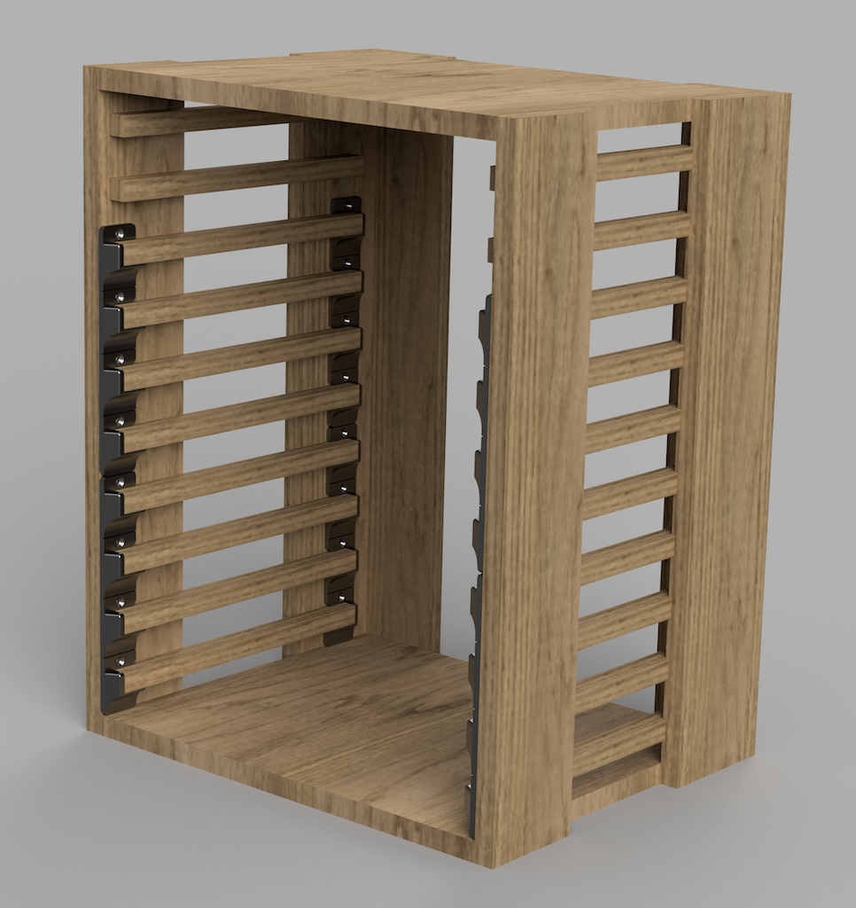
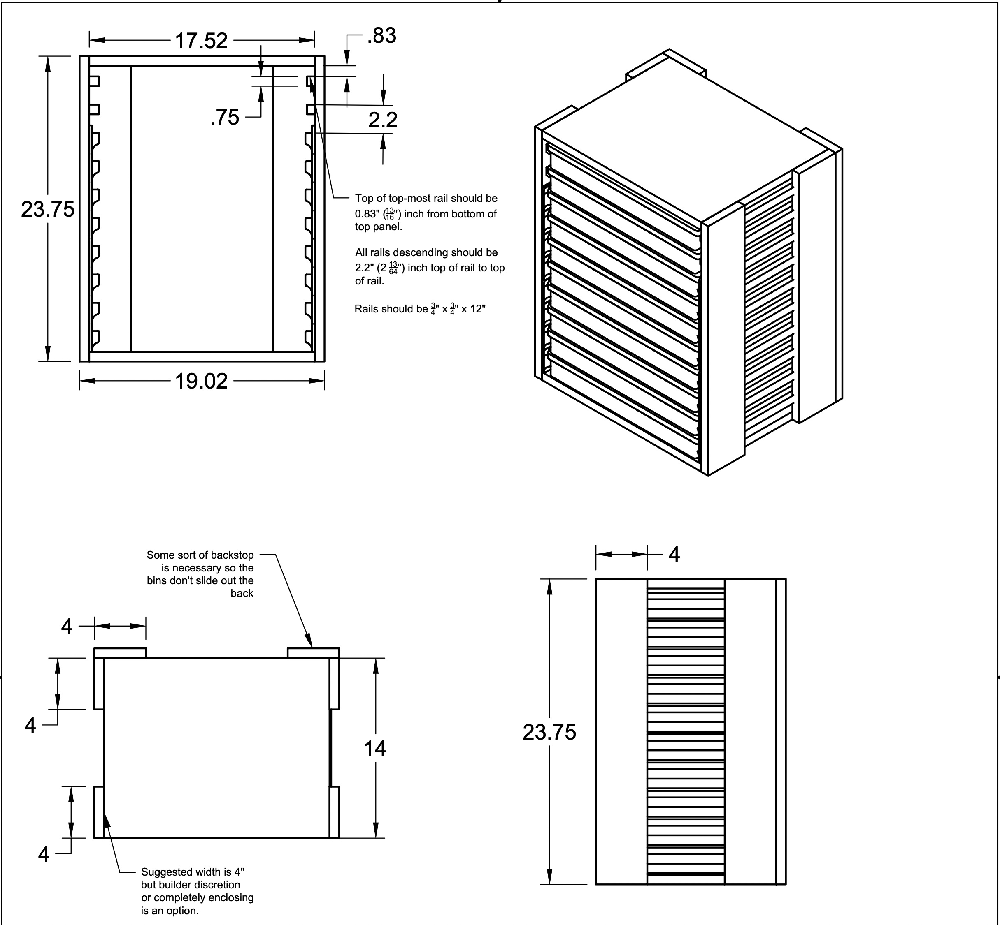

# stanley-organizer-rack
Build specs for a 10 shallow / 5 deep Stanley organizer rack

## Drawings
[PDF Diagram of organizer rack](./assets/stanley-organizer-rack.pdf)

## 3D Printed Funnel + Spacer

The funnel+spacer will help you precsiely position 10 rails on each side of the rack.

Functionally, the funnel+spacer is not required.  But if you are able to print them out, then you can save yourself a lot of tedious measuring and just
screw the spacers to the sides of the rack walls and then place the rails inside.  The spacers also have a filleted edge to help guide the organizer bin when inserting them in the rack.

Building the cabinet as per the diagram above, you'll need to print (5) copies each of LEFT and RIGHT.  (for a total of 10 pieces)

Each side will require (4) full sized spacers.  Two for the front, two for the back.  Each full sized spacer will provide guidance for (4) rails for a total of eight rails.

For the final two rails, by cutting remaining LEFT and RIGHT spacers in half (using a fine saw or a hot wire and the helpful notch in the print), you now have four half-sized parts to create the guides for the two remaining rails.

- [Spacer STL - Left](./assets/Rail-spacer-4-up-Left.stl)
- [Spacer STL - Right](./assets/Rail-spacer-4-up-Right.stl)

## Dimensions

If built using 3/4" Cabinet grade plywood:
* `23.75" tall, 19" (19.02") wide, 14.75" deep`

## Stanley Organizers

- [SHALLOW](https://www.homedepot.com/p/Stanley-25-Compartment-Shallow-Pro-Small-Parts-Organizer-014725R/203707065)
- [DEEP 2x height](https://www.homedepot.com/p/Stanley-10-Compartment-Deep-Pro-Small-Parts-Organizer-014710R/100375900)
